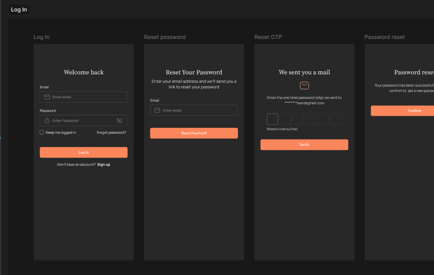
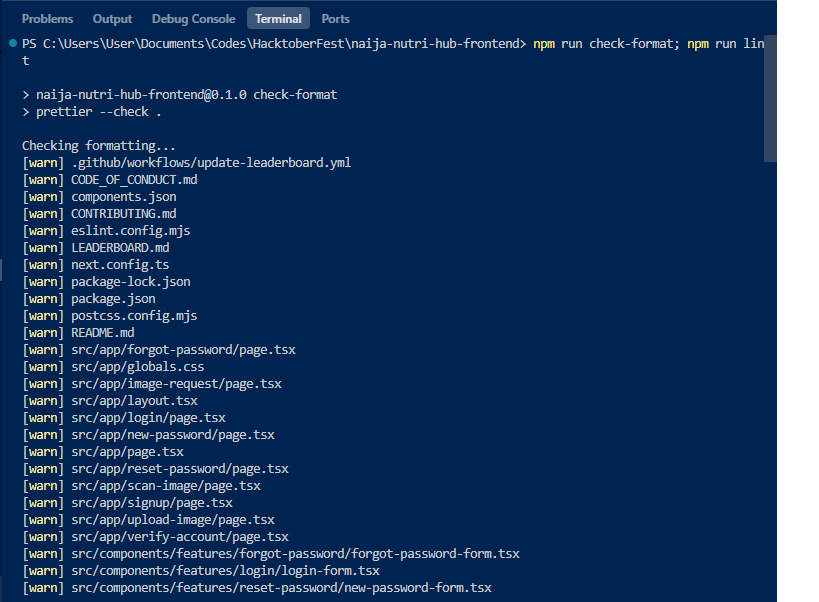

## 🛠️ Contributing to NAIJA-NUTRI-HUB-FRONTEND

Thanks for taking the time to contribute! Your help is valuable and makes this project better for everyone.

This document outlines the comprehensive guidelines for contributing to **NAIJA-NUTRI-HUB-FRONTEND** - the frontend application for the Naija Nutri Hub project, an AI-powered food platform focused on Nigerian cuisine.

### 🍽️ About Naija Nutri Hub

**Naija Nutri Hub** is an end-to-end, AI-powered food platform that allows users to:

- **Take or upload photos** of meals and receive instant food classification
- **Get nutritional estimates** and calorie information for Nigerian dishes
- **Access recipe suggestions** with step-by-step cooking instructions
- **Discover nearby restaurants** that serve similar dishes

This frontend repository is built with modern web technologies and focuses on providing an intuitive, accessible user experience for Nigerian food enthusiasts.

### 🛠️ Technology Stack

- **Framework**: Next.js 15.5.4 with App Router
- **Language**: TypeScript 5
- **UI Library**: React 19.1.0
- **Styling**: Tailwind CSS 4 with CSS Variables
- **Component Library**: shadcn/ui with Radix UI primitives
- **Form Handling**: React Hook Form 7 with Zod validation
- **HTTP Client**: Axios 1.12.2
- **Icons**: Lucide React
- **Notifications**: Sonner
- **Development**: ESLint, TypeScript strict mode

---

## Code of Conduct

This project and its community are governed by the **NAIJA-NUTRI-HUB-FRONTEND Code of Conduct** (or a standard like the Contributor Covenant). By participating, you are expected to uphold this code. Please report unacceptable behavior to us.

- **[CODE_OF_CONDUCT](CODE_OF_CONDUCT.md)**

---

## 💬 How to Ask Questions

If you have a question about how to use **NAIJA-NUTRI-HUB-FRONTEND** or want to discuss a potential feature, please use the following methods before opening an issue:

1.  **Start a discussion on our GitHub Discussions page**
2.  **Ask in any of the [WHATSAPP_COMMUNITIES](WHATSAPP_COMMUNITIES.md)**

---

## 🐛 Reporting Bugs

A great bug report helps us fix the issue faster. Please follow these steps:

### Before Reporting

1.  **Check Existing Issues:** Search the **[GitHub Issues page](https://github.com/mlsanigeria/naija-nutri-hub-frontend/issues)** to see if the bug has already been reported.
2.  **Open a New Issue:** If not, open a new issue and choose the **"Bug Report"** template.
3.  **Be Detailed:**
    - **What version of NAIJA-NUTRI-HUB-FRONTEND are you using?** (e.g., v1.2.3)
    - **What operating system are you on?**
    - **Expected behavior:** What did you expect to happen?
    - **Actual behavior:** What actually happened (include error messages)?
    - **Steps to Reproduce:** Provide a clear and concise set of instructions to reproduce the problem. Code snippets or screenshots are extremely helpful.

---

## ✨ Suggesting Features

We welcome ideas for new features! To propose an enhancement:

1.  **Check Existing Issues/Discussions:** See if the feature has already been proposed or discussed.
2.  **Open a New Issue/Discussion:**
    - For **small changes/improvements**, open a new issue and choose the **"Feature Request"** template.
    - For **large, complex new features**, please **start a Discussion** first to get feedback from the community and maintainers.
3.  **Explain the "Why":** Clearly describe the feature, but more importantly, explain **why** it would be useful and what problem it solves.

---

## 💻 Making Code Contributions (Pull Requests)

Ready to dive into the code? Awesome\! To ensure a smooth process, please follow these guidelines:

### 1\. Development Environment Setup

#### Prerequisites

- **Node.js**: Version 18.17 or higher
- **npm**: Version 9.0 or higher (comes with Node.js)
- **Git**: Latest version
- **Code Editor**: VS Code (recommended) with TypeScript and Tailwind CSS extensions

#### Setup Steps

- Follow the existing **coding style** (e.g., using Prettier, ESLint, or existing conventions).
- **Keep changes focused.** If you are addressing a bug, don't include unrelated refactoring in the same pull request.
- **Add Tests:** If your changes introduce a new feature or fix a bug, please include appropriate tests.

3.  **Install dependencies:**
    ```bash
    npm install
    ```

- **Write clear commit messages.** We recommend using a conventional commit format (e.g., `fix: resolve issue with button padding`).
- **Push your branch** to your fork: `git push origin your-branch-name`

5.  **Start the development server:**

    ```bash
    npm run dev
    ```

    The application will be available at `http://localhost:3000`

6.  **Verify the setup:**
    - Open your browser and navigate to `http://localhost:3000`
    - Check that the application loads without errors
    - Run the linter to ensure code quality: `npm run lint`

#### Available Scripts

- `npm run dev` - Start development server with Turbopack
- `npm run build` - Build the application for production
- `npm run start` - Start production server
- `npm run lint` - Run ESLint for code quality checks
- `npm run format` - Format code using Prettier
- `npm run check-format` - Check if code is properly formatted
- `npm run prepare` - Set up Husky git hooks

### 2\. Creating Your Branch

Create a new branch for your work using descriptive naming:

```bash
# For bug fixes
git checkout -b fix/describe-the-bug

# For new features
git checkout -b feature/describe-the-feature

# For documentation updates
git checkout -b docs/describe-the-update

# For refactoring
git checkout -b refactor/describe-the-refactor
```

**Branch Naming Convention:**

- Use lowercase letters and hyphens
- Start with the type of change: `fix/`, `feature/`, `docs/`, `refactor/`
- Be descriptive but concise

### 3\. Coding Standards & Style Guide

#### TypeScript & JavaScript Guidelines

- **Use TypeScript** for all new files and components
- **Enable strict mode** - all TypeScript strict checks are enabled
- **Define proper types** for all props, state, and function parameters
- **Use interfaces** for object shapes and type definitions
- **Prefer `const` and `let`** over `var`
- **Use arrow functions** for component methods and callbacks
- **Implement proper error handling** with try-catch blocks where appropriate

#### React Component Guidelines

- **Use functional components** with hooks (no class components)
- **Follow the component structure**:

  ```tsx
  // 1. Imports
  import React from "react";
  import { ComponentProps } from "./types";

  // 2. Component definition
  export function ComponentName({ prop1, prop2 }: ComponentProps) {
    // 3. Hooks
    const [state, setState] = useState();

    // 4. Event handlers
    const handleClick = () => {};

    // 5. Render
    return <div>...</div>;
  }
  ```

- **Use proper prop destructuring** and type definitions
- **Implement proper key props** for list items
- **Use React.memo()** for performance optimization when needed

#### File & Folder Structure

- **Use PascalCase** for component files: `UserProfile.tsx`
- **Use camelCase** for utility files: `apiHelpers.ts`
- **Use kebab-case** for page files: `user-profile/page.tsx`
- **Organize components** in feature-based folders under `src/components/features/`
- **Keep UI components** in `src/components/ui/` (shadcn/ui components)

#### Tailwind CSS Guidelines

- **Use utility classes** instead of custom CSS when possible
- **Follow the design system** defined in `src/app/globals.css`
- **Use CSS variables** for consistent theming
- **Responsive design** with mobile-first approach
- **Use semantic color names** from the design system

#### Form Handling

- **Use React Hook Form** for all form implementations
- **Implement Zod validation** for form schemas
- **Follow the existing form patterns** in `src/components/features/`
- **Provide proper error messages** and validation feedback
- **Use controlled components** for form inputs

#### API Integration

- **Use Axios** for HTTP requests (configured in `src/lib/axios.ts`)
- **Implement proper error handling** for API calls
- **Use TypeScript interfaces** for API response types
- **Follow RESTful conventions** for API endpoints

#### Code Quality

- **Run ESLint** before committing: `npm run lint`
- **Fix all linting errors** before submitting PR
- **Write self-documenting code** with clear variable and function names
- **Add comments** for complex logic or business rules
- **Keep functions small** and focused on a single responsibility

#### Performance Guidelines

- **Use Next.js Image component** for optimized images
- **Implement proper loading states** for async operations
- **Use dynamic imports** for code splitting when appropriate
- **Optimize bundle size** by avoiding unnecessary dependencies

### 4\. Testing Guidelines

#### Testing Requirements

- **Write unit tests** for utility functions and custom hooks
- **Test component behavior** with user interactions
- **Test form validation** and error handling
- **Test API integration** with mock data
- **Ensure accessibility** with proper ARIA labels and keyboard navigation

#### Testing Tools

- **Jest** for unit testing
- **React Testing Library** for component testing
- **MSW (Mock Service Worker)** for API mocking
- **Accessibility testing** with axe-core

### 5\. Keep Changes Focused

- **Address one issue** per pull request
- **Don't mix bug fixes** with feature additions
- **Don't include unrelated refactoring** in the same PR
- **Keep PRs small** and reviewable (ideally under 400 lines of changes)

### 6\. Git Hooks & Quality Assurance

This project uses **Husky** to enforce code quality through git hooks. These hooks run automatically and **must pass** before you can commit or push your changes.

#### Pre-commit Hook

The pre-commit hook runs automatically when you try to commit and checks:

1. **Code Formatting (Prettier)**

   ```bash
   npm run check-format
   ```

   - Ensures consistent code formatting across the project
   - If formatting fails, you'll see: `🤢🤮🤢🤮 Its FORKING RAW - Your styling looks disgusting`
   - **Fix**: Run `npm run format` to auto-format your code

2. **Code Quality (ESLint)**

   ```bash
   npm run lint
   ```

   - Checks for code quality issues, unused variables, and best practices
   - If linting fails, you'll see: `😤🏀👋😤 Get that weak shit out of here!`
   - **Fix**: Address all ESLint errors and warnings before committing

#### Pre-push Hook

The pre-push hook runs automatically when you try to push and checks:

1. **Build Success**

   ```bash
   npm run build
   ```

   - Ensures your code compiles successfully
   - If build fails, you'll see: `❌👷🔨❌ Build failed... Is your development server still running?`
   - **Fix**: Resolve all build errors before pushing

#### Manual Quality Checks

Before committing, always run these commands manually:

```bash
# 1. Format your code
npm run format

# 2. Check for linting issues
npm run lint

# 3. Ensure build passes
npm run build

# 4. Add formatted files to git
git add .

# 5. Commit your changes
git commit -m "feat: your commit message"
```

#### Common Issues and Solutions

**Formatting Issues:**

```bash
# Auto-fix formatting
npm run format
git add .
git commit -m "style: format code"
```

**ESLint Warnings:**

- **Unused variables**: Remove or use the variable
- **Missing dependencies**: Add to useEffect dependency array
- **Console.log statements**: Remove or replace with proper logging
- **Any other warnings**: Address them before committing

#### Minimizing ESLint Warnings

**All ESLint warnings should be minimized** except when strictly necessary. Here's how to handle common warnings:

**Unused Variables:**

```tsx
// ❌ Bad - Unused variable warning
const [data, setData] = useState(null);
const unusedVar = "not used";

// ✅ Good - Remove unused variables
const [data, setData] = useState(null);
// unusedVar removed

// ✅ Good - Use underscore prefix for intentionally unused
const [data, setData] = useState(null);
const _unusedVar = "intentionally unused";
```

**Missing Dependencies:**

```tsx
// ❌ Bad - Missing dependency warning
useEffect(() => {
  fetchData(userId);
}, []); // userId missing from dependencies

// ✅ Good - Include all dependencies
useEffect(() => {
  fetchData(userId);
}, [userId]);
```

**Console Statements:**

```tsx
// ❌ Bad - Console.log in production code
console.log("Debug info:", data);

// ✅ Good - Remove or use proper logging
// console.log removed

// ✅ Good - Use proper error handling
if (process.env.NODE_ENV === "development") {
  console.log("Debug info:", data);
}
```

**Import/Export Issues:**

```tsx
// ❌ Bad - Unused import
import { useState, useEffect } from "react";
// useEffect not used

// ✅ Good - Remove unused imports
import { useState } from "react";
```

**TypeScript Warnings:**

```tsx
// ❌ Bad - Any type usage
const data: any = fetchData();

// ✅ Good - Proper typing
interface DataType {
  id: string;
  name: string;
}
const data: DataType = fetchData();
```

**Build Failures:**

- Check for TypeScript errors
- Ensure all imports are correct
- Verify component props and types
- Check for missing dependencies

### 7\. Component Development Guidelines

#### Making Component Props Optional

When updating existing components, **always make new props optional** to prevent breaking changes:

```tsx
// ❌ Bad - Breaking change
interface ButtonProps {
  variant: "primary" | "secondary";
  size: "sm" | "md" | "lg";
  newProp: string; // This will break existing usage
}

// ✅ Good - Backward compatible
interface ButtonProps {
  variant: "primary" | "secondary";
  size: "sm" | "md" | "lg";
  newProp?: string; // Optional prop with default value
}

export function Button({ variant, size, newProp = "default" }: ButtonProps) {
  // Component implementation
}
```

#### Component Update Checklist

- [ ] New props are optional with sensible defaults
- [ ] Existing functionality remains unchanged
- [ ] TypeScript types are properly defined
- [ ] Component is tested with and without new props
- [ ] Documentation is updated if needed

### 6\. Commit and Push

#### Commit Message Guidelines

Use **Conventional Commits** format for clear, consistent commit messages:

```bash
# Format: type(scope): description
# Examples:
git commit -m "feat(auth): add login form validation"
git commit -m "fix(ui): resolve button padding issue"
git commit -m "docs(readme): update installation instructions"
git commit -m "refactor(api): simplify user data fetching"
git commit -m "test(auth): add login form unit tests"
```

**Commit Types:**

- `feat`: New feature
- `fix`: Bug fix
- `docs`: Documentation changes
- `style`: Code style changes (formatting, etc.)
- `refactor`: Code refactoring
- `test`: Adding or updating tests
- `chore`: Maintenance tasks

#### Push Your Changes

```bash
git push origin your-branch-name
```

### 7\. Create a Pull Request (PR)

#### Before Creating a PR

Complete this comprehensive checklist before submitting your PR:

##### Code Quality Checklist

- [ ] **Code is formatted**: Run `npm run format` and commit changes
- [ ] **No linting errors**: Run `npm run lint` and fix all errors
- [ ] **Minimal warnings**: Address ESLint warnings (unused variables, etc.)
- [ ] **Build successful**: Run `npm run build` and ensure no errors
- [ ] **TypeScript errors resolved**: All type errors are fixed
- [ ] **No console.log statements**: Remove or replace with proper logging
- [ ] **Unused imports removed**: Clean up any unused imports
- [ ] **Code follows style guide**: Follows project conventions

##### Git & Branch Management

- [ ] **Branch is up to date**: Rebased with latest main branch
- [ ] **No merge conflicts**: Resolved all conflicts with main
- [ ] **Clean commit history**: Meaningful commit messages
- [ ] **Focused changes**: One feature/fix per PR
- [ ] **Files are staged**: All changes are properly committed

##### Testing & Validation

- [ ] **Manual testing completed**: Tested all functionality
- [ ] **Cross-browser testing**: Works in Chrome, Firefox, Safari
- [ ] **Mobile responsive**: Tested on mobile devices
- [ ] **Accessibility checked**: Proper ARIA labels and keyboard navigation
- [ ] **Performance verified**: No significant performance regressions

##### Documentation & Screenshots

- [ ] **Screenshots included**: Figma design, local implementation, Husky checks
- [ ] **PR description complete**: Clear description of changes
- [ ] **Issue referenced**: Links to related issue
- [ ] **Breaking changes documented**: If any breaking changes exist

##### Final Commands to Run

```bash
# 1. Update with latest main
git checkout main
git pull origin main
git checkout your-branch-name
git rebase main

# 2. Final quality checks
npm run format
npm run lint
npm run build

# 3. Stage and commit any formatting changes
git add .
git commit -m "style: format code before PR"

# 4. Push your changes
git push origin your-branch-name
```

##### Pre-PR Validation Script

You can run this script to validate everything before creating a PR:

```bash
#!/bin/bash
echo "🔍 Running pre-PR validation..."

echo "📝 Formatting code..."
npm run format

echo "🔍 Checking linting..."
npm run lint

echo "🏗️ Building project..."
npm run build

echo "✅ All checks passed! Ready to create PR."
```

#### Creating the PR

1. **Open a Pull Request** against the **`main`** branch
2. **Use the PR Template** and fill out all sections:
   - **Description**: What changes were made and why
   - **Type of Change**: Bug fix, feature, documentation, etc.
   - **Testing**: How the changes were tested
   - **Screenshots**: Include required screenshots (see below)
   - **Checklist**: Confirm all requirements are met

3. **Reference the Issue**: Link to the issue being addressed:
   ```
   Fixes #123
   Closes #456
   Related to #789
   ```

#### Required Screenshots

For UI/UX changes, you **must** include these screenshots in your PR:

1. **Figma Design Screenshot**
   - Screenshot of the design from [Figma](https://www.figma.com/design/JD4yFts6kF1mLQzictb2F4/hactober-fest?node-id=0-1)
   - Show the intended design and layout
   - Include any design specifications or annotations

   **Example:**
   
   _Screenshot showing the Figma design for the component/page being implemented_

2. **Local Development Screenshot**
   - Screenshot of your implementation running locally
   - Show the actual rendered component/page
   - Include browser developer tools if relevant

   **Example:**
   
   _Screenshot showing the actual implementation running on localhost_

3. **Husky Checks Passed Screenshot**
   - Screenshot showing successful pre-commit and pre-push hooks
   - Terminal output showing:
     - ✅ Prettier formatting check passed
     - ✅ ESLint check passed
     - ✅ Build successful
   - Example terminal output:
     ```
     🏗️👷  Have formatted the codebase? Checking styling, linting, and testing your project before committing.
     ✅ Prettier check passed
     ✅ ESLint check passed
     🤔🤔🤔🤔... We need to build your code before we push... 🤔🤔🤔🤔
     ✅ Build successful
     ```

   **Example Terminal Output:**

   ```
   $ git commit -m "feat: add new login form component"
   🏗️👷  Have formatted the codebase? Checking styling, linting, and testing your project before committing.
   ✅ Prettier check passed
   ✅ ESLint check passed

   $ git push origin feature/login-form
   🤔🤔🤔🤔... We need to build your code before we push... 🤔🤔🤔🤔
   ✅ Build successful
   ```

#### Screenshot Guidelines

- **High quality**: Use clear, high-resolution screenshots
- **Full page**: Show the complete component/page, not just a portion
- **Consistent browser**: Use the same browser for all screenshots
- **Mobile responsive**: Include mobile view if applicable
- **Before/After**: For bug fixes, show both the broken and fixed states

#### How to Take Screenshots

**1. Figma Design Screenshot:**

- Open the [Figma design](https://www.figma.com/design/JD4yFts6kF1mLQzictb2F4/hactober-fest?node-id=0-1)
- Navigate to the specific component/page you're implementing
- Take a full-page screenshot or crop to show the relevant design
- Save as `figma-design.png` or similar descriptive name

**Example:**

_Screenshot showing the Figma design for the component/page being implemented_

**2. Local Development Screenshot:**

- Run your local development server: `npm run dev`
- Navigate to the page/component you've implemented
- Take a screenshot of the rendered page
- Save as `localhost-implementation.png` or similar descriptive name

**Example:**

_Screenshot showing the actual implementation running on localhost_

**3. Husky Checks Screenshot:**

- Open your terminal/command prompt
- Run the commit and push commands
- Take a screenshot of the terminal showing successful checks
- Save as `husky-checks-passed.png` or similar descriptive name

**Example:**

_Screenshot showing the actual husky check implementation_

## Screenshots

- **Figma Design**: Shows the intended design and layout
- **Local Implementation**: Shows the actual rendered component
- **Husky Checks**: Confirms all quality checks passed

## Changes Made

- Added new login form component
- Implemented form validation with Zod
- Added proper TypeScript types
- Ensured responsive design

## Testing

- [x] Component renders correctly
- [x] Form validation works
- [x] Responsive on mobile devices
- [x] All Husky checks pass

```

#### PR Review Process
1. **Automated Checks**: CI/CD pipeline will run tests and linting
2. **Code Review**: Maintainers will review your code for:
   - Code quality and style
   - Functionality and logic
   - Performance implications
   - Security considerations
   - Accessibility compliance

3. **Feedback and Iteration**:
   - Address all review comments
   - Make requested changes
   - Respond to feedback professionally
   - Update the PR description if needed

4. **Approval and Merge**: Once approved, your PR will be merged

#### PR Best Practices
- **Keep PRs focused** - one feature or bug fix per PR
- **Write descriptive titles** - "Add user authentication" not "Update code"
- **Provide context** - explain the problem and solution
- **Include tests** - demonstrate that your changes work
- **Update documentation** - if your changes affect user-facing features
- **Be responsive** - address feedback promptly

> **Note on Major Changes:** For significant changes (API modifications, architectural changes, breaking changes), please:
> 1. Open an issue first to discuss the approach
> 2. Create a draft PR for early feedback
> 3. Ensure community consensus before implementation

---

## 📄 Documentation Contributions

Documentation is just as important as the code! Contributions to the documentation are highly valued and help make the project accessible to everyone.

- Documentation files are located in **[e.g., the `/docs` folder or a separate repository]**.
- You can treat documentation changes like code contributions by following the steps in the section above.

---

## ⚖️ Licensing

By contributing, you agree that your contributions will be licensed under the **MIT License**.
```
